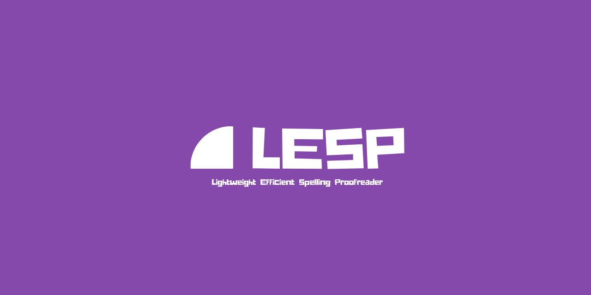

<div align="center">
<h1>LESP - Lightweight Efficient Spelling Proofreader</h1>

</div>

---

<div align="center">


<!-- No dependencies -->

</div>

## Welcome to the LESP repository! 👋

LESP is a lightweight, efficient spelling proofreader written in Python. It's designed to be easy to use and lightweight, while still providing a decent result when checking for spelling errors. Resource consumption is kept to a minimum, and the program is designed to be as fast as possible.

## Features ✨

- Lightweight and efficient
- Easy to use
- Fast
- Cross-platform
- No dependencies
- (Kind of) Customizable

## Installation 📥

Simply clone the repository and run the `demo.py` file to check it out. You don't need to install any additional libraries, so this is like plug-and-play. Just note that anything below Python 3.6 won't run this since old versions don't support `concurrent.futures`, which is used to speed up the process.

PyPi package coming soon, so stay tuned for a more convenient way to install LESP!

### Detailed installation instructions

1. Clone the repository

```bash
git clone https://github.com/LyubomirT/lesp.git
```

2. Open the folder

```bash
cd lesp
```

3. Run the demo

```bash
python demo.py
```

## Usage 📖

LESP is pretty easy to setup, and basic demo configuration is already pre-built. You can find it in `demo_config` (this is a file, not a folder!) and you can edit it to your liking. Note that the file is **required** for the demo to run, so don't delete, move, or rename it. Not required for installing it with `pip` though (coming soon).

### Basic usage

To use LESP, you need to import the `Proofreader` class from the `lesp` module. The class has a decent amount of functions, but the most important ones are `is_correct` and `get_similar`. Here's an example:

```python
from lesp.autocorrect import Proofreader

proofreader = Proofreader(wordlist="my_wordlist.txt")
clearlynotcorrect = proofreader.is_correct("apgle") # False

if not clearlynotcorrect:
    print("Did you mean: " + proofreader.get_similar("apgle")) # Did you mean: apple
```

Simple as that!

### Advanced usage

By default, `Proofreader` will use the `lesp-wordlist.txt` file as the wordlist.

You can use a different wordlist by specifying the path to it in the `wordlist` argument, when initializing the `Proofreader` class.

A wordlist must be structured with each word on a new line, like this:

```
apple
banana
orange
```

When finished with writing your wordlist, save it as a `.txt` file. Then, you can use it like this:

```python
from lesp.autocorrect import Proofreader

proofreader = Proofreader(wordlist="my_wordlist.txt")
```

You can customize the process of getting similar words as well. Configuration will be provided as arguments to the `get_similar` function. Here's an example:

```python
from lesp.autocorrect import Proofreader

proofreader = Proofreader(wordlist="my_wordlist.txt")

similar_words = proofreader.get_similar("apgle", similarity_rate=0.5, chunks=4, upto=3)

print(similar_words)
```

In the code above, we're getting similar words to `apgle` with a similarity rate of 0.5, splitting the wordlist into 4 chunks, and returning up to 3 similar words. 

A similarity rate of `0.5` means that the words returned will be at least 50% similar to the word we're checking. The higher the similarity rate, the more precise the results will be, but generally there will be less words. Myself I would recommend to keep the similarity rate at `0.5`, but you can experiment with it and see what works best for you.

The `chunks` argument specifies how many chunks the wordlist will be split into. This is useful if you have a large wordlist and you want to speed up the process. The higher the number, the faster the process will be, but the more memory/CPU it will consume. For example, when trying to scan `wordlist.txt` with 1500 chunks, the process takes about 0.5 seconds on my machine, but it consumes about 1.5 GB of RAM and 44% of one of the CPU cores. If you have a large wordlist.

The `upto` argument specifies how many similar words will be returned. If you set it to `3`, then the function will return up to 3 similar words. If you set it to `1`, then it will return up to 1 similar word. But, whatever amount you select, the output will still be a list. If you set it to `0`, then the function will raise a `ValueError`.

### Get similarity score

Even if this function isn't really supposed to be a feature, you can still use it if you want to. It's pretty simple to use, just use the `get_similarity_score` function of the `Proofreader` class and pass the two words you want to compare as arguments. Here's an example:

```python
from lesp.autocorrect import Proofreader

proofreader = Proofreader(wordlist="my_wordlist.txt")

score = proofreader.get_similarity_score("apple", "apgle") # 0.8

print(score)
```

The function will return a float between 0 and 1, where 0 means that the words are completely different, and 1 means that the words are exactly the same.

### Backup

If you're concerned about losing your wordlist, you can use the `backup` function to backup your wordlist. It will create a file in the path you specify, and it will write the wordlist in it. Note that the file will be overwritten if it already exists. Here's an example:

```python
from lesp.autocorrect import Proofreader

proofreader = Proofreader(wordlist="my_wordlist.txt")

proofreader.backup("my_wordlist_backup.txt") # Leave empty to use default path
```

### Restore

If you've backed up your wordlist, you can restore it using the `restore` function. It will read the file you specify and it will overwrite the current wordlist with the one in the file. Note that the file must exist, otherwise the function will raise a `FileNotFoundError`. Here's an example:

```python
from lesp.autocorrect import Proofreader

proofreader = Proofreader(wordlist="my_wordlist.txt")

proofreader.restore(True, "my_wordlist_backup.txt") # Leave empty to use default path
```

True here stands for `overridecurrent`, which lets you choose whether you want the wordlist file to be overwritten or not. If you set it to `False`, then the function will leave your current wordlist file untouched, and will just modify the wordlist variable in the current session. If you set it to `True`, then the function will overwrite the wordlist file with the one in the backup file along with the wordlist variable in the current session.

### Extend wordlist

This is useful if the user usually writes about a specific, non-general topic. For example, if the user is a programmer, you can extend the wordlist with programming-related words if one is not found in the wordlist already. Here's an example:

```python
from lesp.autocorrect import Proofreader

proofreader = Proofreader(wordlist="my_wordlist.txt")

if not proofreader.is_correct("reactjs") and proofreader.get_similar("reactjs") is None:
    confirm = input("reactjs is not in the wordlist. Would you like to add it? (y/n) ")
    if confirm.lower() == "y":
        proofreader.backup()
        proofreader.extend_wordlist("reactjs")
        print("reactjs added to wordlist.")
    else:
        pass
```

You can also extend the wordlist with multiple words at once by passing a list or a tuple to the function. Like this:

```python
from lesp.autocorrect import Proofreader

proofreader = Proofreader(wordlist="my_wordlist.txt")

words = ["reactjs", "vuejs", "angularjs"]

proofreader.extend_wordlist(words)
```

### Remove from wordlist

An opposite of the `extend_wordlist` function, this function removes a word from the wordlist. Note that this function will raise a `ValueError` if the word is not in the wordlist. Also note that this function will not remove the word from the wordlist permanently, it will only remove it for the current session. Here's an example:

```python
from lesp.autocorrect import Proofreader

proofreader = Proofreader(wordlist="my_wordlist.txt")

word = "reactjs"
proofreader.remove_from_wordlist(word)
```

If you want to remove multiple words at once, you can pass a list or a tuple to the function. Like this:

```python
from lesp.autocorrect import Proofreader

proofreader = Proofreader(wordlist="my_wordlist.txt")

words = ["reactjs", "vuejs", "angularjs"]

proofreader.remove_from_wordlist(words)
```

### Stacking

This function lets you stack two wordlist files together, so you can have a bigger wordlist out of two combined. The function will take two arguments, the source file and the destination file. The source file is the file that will be stacked on top of the destination file. Here's an example:

```python
from lesp.autocorrect import Proofreader

proofreader.stack("wordlist.txt", "my_wordlist.txt")
```

### Merge delete

This function lets you delete all words from the destination file that are in the source file. For example, if you have a wordlist with the following words:

```
apple
banana
orange
```

And you have another wordlist with the following words:

```
apple
banana
raspberry
```

Then, if you use the `merge_delete` function, the destination file will be modified to look like this:

```
orange
raspberry
```

Here's an example of how you can use it:

```python
from lesp.autocorrect import Proofreader

proofreader = Proofreader(wordlist="my_wordlist.txt")

proofreader.merge_delete("wordlist.txt", "my_wordlist.txt")

with open("my_wordlist.txt", "r") as f:
    print(f.read())
```

### Caching

To improve the perfomance of LESP, `get_similar` uses a cache file to store similar words. This way, if you check the same word multiple times, it will be much faster. The default cache file is `lesp_cache/lesp.cache`, but you can change it by specifying the `cache_file` argument when initializing the `Proofreader` class. Here's an example:

```python
from lesp.autocorrect import Proofreader

proofreader = Proofreader(wordlist="my_wordlist.txt", cache_file="my_cache.cache")
```

Cache works only for mistakes that have been made at least once. For example, if you check the word `apgle` and it returns `apple`, then the next time you check `apgle`, it will be much faster. This can save a lot of time and resources, especially if the user makes a lot of mistakes.

If you want to clear the cache, you can use the `clear_cache` function. Here's an example:

```python
from lesp.autocorrect import Proofreader

proofreader = Proofreader(wordlist="my_wordlist.txt", cache_file="my_cache.cache")

proofreader.clear_cache()
```

This will delete the cache file and clear the cache variable in the current session. Note that the file will be deleted permanently, so make sure you have a backup if you want to keep it.

To use the cache, you need to specify the `use_cache` (or `set_cache` if you want it to be modified) argument when calling the `get_similar` function. Here's an example:

```python
from lesp.autocorrect import Proofreader

proofreader = Proofreader(wordlist="my_wordlist.txt", cache_file="my_cache.cache")

similar_words = proofreader.get_similar("apgle", similarity_rate=0.5, chunks=4, upto=3, use_cache=True, set_cache=True) # Takes about 0.18 seconds on my machine
similar_words2 = proofreader.get_similar("apgle", similarity_rate=0.5, chunks=4, upto=3, use_cache=True, set_cache=True) # Works almost instantly thanks to cache
```

Here, `use_cache` is responsible for using the loaded cache file (if it exists) and `set_cache` helps you to add a new mistake to cache. If you set `set_cache` to `True`, then the function will add the mistake to cache, so the next time you check the same word, it will be much faster with `use_cache` enabled.

## Examples 📝

If you're still not sure where to use LESP, you can check out the `examples` folder. It contains some examples of how you can use LESP in your projects. These examples are pretty simple, but they should give you an idea of how you can use LESP in your projects.

### How to run an example?

Simply open the folder of the example you want to run, then copy the `main.py` file to the root of the directory (same as `demo.py`, for instance). After that, run the `main.py` file and voila! The application is running!

## Contributing 🤝

Contributions, issues and feature requests are welcome! Feel free to check out the [issues page](https://github.com/LyubomirT/lesp/issues).

### How to contribute?

Thank you for your interest in contributing to LESP! Here's a quick guide on how to contribute:

1. Fork the repository

```bash
git clone https://github.com/LyubomirT/lesp.git
```

2. Make your changes

3. Test your changes to make sure everything works as expected

4. Commit your changes

```bash
git commit -m "Your changes"
```

5. Push your changes

```bash
git push
```

6. Open a pull request

7. Wait for your pull request to be reviewed

Once again, thank you for your support!

## Reach out to the developer 👨‍💻

You can contact me on Discord either in my [Discord Server](https://discord.gg/XkjPDcSfNz) or in my DMs (@lyubomirt). Creating a discussion might also work, but I'm a bit faster to respond on Discord.

## Future plans 📅

- [ ] Optimize even further
- [x] Add more examples
- [x] Improve documentation

## License 📜

This project is licensed under the BSD 3-Clause License. For more information, please refer to the `LICENSE` file.

## Acknowledgements 🙏

Many thanks to the following Open-Source projects:

- [Google 10000 English](https://github.com/first20hours/google-10000-english) - `small_wordlist.txt`
- [English Word List](https://github.com/dwyl/english-words) - `wordlist.txt`

## Our Amazing Contributors ✨

Thanks to these awesome people for contributing! I appreciate your support a lot! ❤️

[](https://github.com/lyubomirt/lesp/graphs/contributors)

(Note that due to a glitch, some contributors may not appear in the grid)
